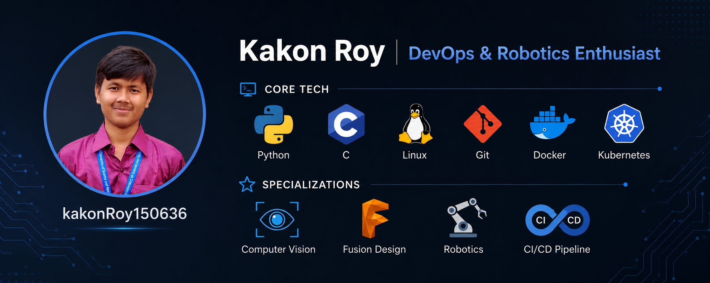

<div align="center">

### Engineer · Builder · Problem Solver

[](https://github.com/kakonRoy150636)
[](https://www.linkedin.com/in/kakon-roy-96bb8035a)
[](https://facebook.com/KakonRoy150636)
[](mailto:kakonroy150636@gmail.com)

</div>

---

<div align="center">

`Embedded Systems` ◆ `Robotics` ◆ `Computer Vision` ◆ `Fusion Design` ◆ `git` ◆ `Web Development` ◆ `Full Stack` ◆ `Matlab` ◆ `Linux` ◆ `Python`

</div>

---

### 👤 Who I Am

```python
class Engineer:
    def __init__(self):
        self.name = "Kakon Roy"
        self.university = "SUST"
        self.department = "EEE"
        self.interests = [
            "Embedded Systems",
            "Robotics",
            "Computer Vision",
            "Fusion Design",
            "Full Stack developer",
            "AI"
        ]
```

🎓 **Education** — Electrical & Electronic Engineering at Shahjalal University of Science and Technology (SUST), Sylhet

🎯 **Focus Areas** — Embedded Systems, Robotics, Computer Vision, Fusion Design,  Bridging hardware and software.

⚙️ **Approach** — Combining hardware expertise, algorithmic thinking, and modern DevOps practices to build robust, scalable systems.
<!-- 🌐 Mac Browser Frame Showcase -->
<table width="100%" style="border-collapse: collapse; border: 1px solid #30363d;">
  <!-- Browser Bar -->
  <tr bgcolor="#161b22">
    <td colspan="2" style="padding: 10px 15px;">
      <span style="color: #ff5f56; font-size: 16px;">●</span>
      <span style="color: #ffbd2e; font-size: 16px;">●</span>
      <span style="color: #27c93f; font-size: 16px;">●</span>
      &nbsp;&nbsp;
      <code style="color: #8b949e; background: #0d1117; padding: 4px 12px; border-radius: 6px; border: 1px solid #30363d;">
        🔒 https://kroybd.netlify.app
      </code>
    </td>
  </tr>
  <!-- Browser Content -->
  <tr bgcolor="#0d1117">
    <td width="65%" style="padding: 20px; vertical-align: top;">
      <!-- Typing Animation Header -->
      <a href="https://kroybd.netlify.app" target="_blank">
        
      </a>
      <p style="color: #8b949e; font-size: 14px; line-height: 1.6;">
        আমার নিজের আর্কিটেক্ট ও তৈরি করা একটি কাস্টম ওয়েব প্ল্যাটফর্ম। এখানে লাইভ ইন্টারঅ্যাক্টিভ প্রিভিউ সহ মডার্ন, রেসপন্সিভ এবং হাই-পারফরম্যান্স ওয়েব টেমপ্লেট শোকেস করা হয়।
      </p>
      <br/>
      <a href="https://kroybd.netlify.app" target="_blank">
        
      </a>
    </td>
    <td width="35%" bgcolor="#161b22" align="center" style="padding: 20px; vertical-align: middle;">
      
      <br/><br/>
      
      <br/><br/>
      
    </td>
  </tr>
</table>

---

### 🛠️ Tech Stack & Proficiency

<p align="center">
  <a href="https://skillicons.dev">
    
  </a>
</p>

| Category | Technical Expertise | Mastery |
| :--- | :--- | :--- |
| <b>💻 Software</b> | `Python` `C/C++` `Bash Scripting` | `████████░░` **85%** |
| <b>🌐 Full Stack</b> | `JavaScript` `React` `Node.js` `FastAPI` `PostgreSQL` | `████████░░` **82%** |
| <b>🤖 Robotics & CV</b> | `OpenCV` `ROS` `Fusion 360` `Embedded Vision` | `████████░░` **80%** |
| <b>🛠️ Tooling & Hardware</b> | `Arduino` `Git/GitHub` `Linux Kernel` `PCB/Hardware` | `█████████░` **88%** |


---

### ⚡ Tech Stack

<div align="center">


</div>

---

### 🔥 Interests

| # | Interest | Description |
|---|----------|-------------|
| 01 | **Embedded Systems** | Designing firmware and hardware-software interfaces for real-time control systems. Building the intelligence that powers physical devices. |
| 02 | **Robotics** | Integrating sensors, actuators, and algorithms for autonomous behavior. Creating systems that perceive and interact with the physical world. |
| 03 | **Computer Vision** | Developing algorithms for image processing and visual understanding. Enabling machines to interpret and act on visual data with precision. |
| 04 | **Fusion Design** | Combining engineering principles with modern design thinking. Creating systems where functionality and aesthetics converge seamlessly. |
| 05 | **AI** | Implementing intelligent algorithms for pattern recognition and decision-making. Pushing the boundaries of what machines can learn and accomplish. |

---
### 📊 GitHub Stats

<div align="center">


</div>

### 🟢 Current Status

| Platform | Status | Link |
|----------|--------|------|
|  | 🟢 Active | [kakonRoy150636](https://github.com/kakonRoy150636) |
|  | 🟢 Active | [Kakon Roy](https://www.linkedin.com/in/kakon-roy-96bb8035a) |
|  | 🟡 Away | [KakonRoy150636](https://facebook.com/KakonRoy150636) |
|  | 🟢 Active | [kakonroy150636@gmail.com](mailto:kakonroy150636@gmail.com) |

---

### 📬 Let's Build Something

<div align="center">

[](https://facebook.com/KakonRoy150636)
[](https://www.linkedin.com/in/kakon-roy-96bb8035a)
[](mailto:kakonroy150636@gmail.com)

</div>

---

<div align="center">

© 2025 Kakon Roy · SUST EEE

</div>
